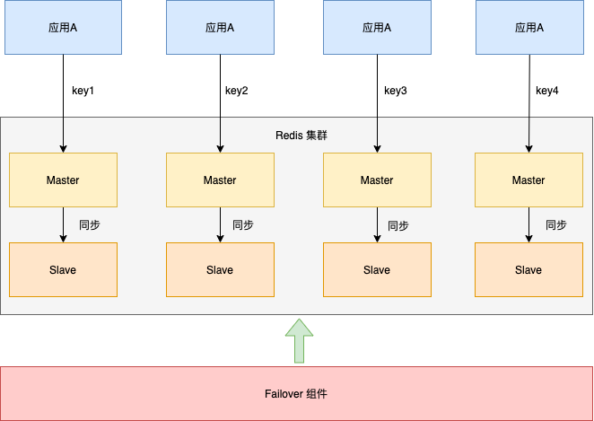

## 前言

缓存在日常开发中举足轻重，如果你的应用对某类数据有着较高的读取频次，并且改动较小时那就非常适合利用缓存来提高性能。
缓存之所以可以提高性能是因为它的读取效率很高，就像是 CPU 的 L1、L2、L3 缓存一样，级别越高相应的读取速度也会越快。
但也不是什么好处都占，读取速度快了但是它的内存更小资源更宝贵，所以我们应当缓存真正需要的数据。

> 其实也就是典型的空间换时间。

## 为什么要使用缓存
1. 提高应用程序的性能：

    当应用程序需要访问数据库或其他外部资源时，如果这些资源的数据经常变化，那么每次请求都需要重新获取数据，这会导致应用程序的响应时间变慢。使用缓存可以将常用的数据存储在高速缓存中，这样下一次请求相同的数据时就可以直接从缓存中获取，而不需要再次查询数据库或其他外部资源，从而提高了应用程序的性能。
2. 减少数据库负载：

    当应用程序频繁地访问数据库时，会给数据库带来很大的压力，导致数据库响应变慢或者崩溃。使用缓存可以将一些常用的数据存储在高速缓存中，这样下一次请求相同的数据时就可以直接从缓存中获取，而不需要再次查询数据库，从而减少了对数据库的负载。 
3. 提高用户体验：
   
    当应用程序的响应速度变快时，用户的体验也会得到提升。使用缓存可以避免用户等待过长时间才能看到页面的变化，从而提高了用户的满意度。 
4. 支持高并发访问：
  
    当多个用户同时访问应用程序时，如果每个用户都需要访问数据库或其他外部资源，那么会对系统造成很大的负担。使用缓存可以将一些常用的数据存储在高速缓存中，这样多个用户同时访问时就可以共享缓存中的数据，从而减轻了系统的负担。
 
总之，使用缓存可以提高应用程序的性能、减少数据库负载、提高用户体验和支持高并发访问。因此，缓存是高并发系统必须考虑的一个重要因素。

对于应用系统来讲，我们经常将缓存划分为本地缓存和分布式缓存。

- 本地缓存 ：应用中的缓存组件，缓存组件和应用在同一进程中，缓存的读写非常快，没有网络开销。但各应用或集群的各节点都需要维护自己的单独缓存，无法共享缓存。
- 分布式缓存：和应用分离的缓存组件或服务，与本地应用隔离，多个应用可直接共享缓存。

## 本地缓存
虽然使用 JDK Map 能快捷构建缓存，但缓存的功能还是比较孱弱的。
因为现实场景里，我们可能需要给缓存添加缓存统计、过期失效、淘汰策略等功能.

特性	  | ConcurrentHashMap | Ehcache                            | Guava Cache      | Caffeine                    |
-------- |-------------------|------------------------------------|--------------------------|-----------------------------|
访问性能 | 最高                | 一般                                 | 良好               | 优秀<br> 接近于ConcurrentHashMap |
淘汰策略 | 无                 | 支持多种淘汰策略<br/>FIFO、LRU、LFU          | LRU              | W-TinyLFU<br/>（结合LRU和LFU算法的优缺点）  |
扩展功能 | 只能提供基础的访问接口       | 并发级别控制<br/>失效策略<br/>事件通知<br/>统计信息等 | 大致同左             | 大致同左                        |

```java
    private Cache<String,UserVo> userCache = Caffeine.newBuilder()
            .maximumSize(1000).expireAfterWrite(10, TimeUnit.MINUTES)
            .build();
    @Override
    public UserVo selectUserByLoginName(String userName) {
        UserVo userVo = userCache.getIfPresent(userName);
        if(Objects.nonNull(userVo)){
            return userVo;
        }
       userVo = mpUserService.lambdaQuery().eq(SysUser::getLoginName, userName)
                .eq(SysUser::getDelFlag, Married.NO.getValue())
                .list().stream().findFirst()
                .map(userConverter::entityToVo).orElse(null);
        Optional.ofNullable(userVo).ifPresent(item->userCache.put(userName,item));
        return userVo;
    }
```

虽然本地缓存框架的功能很强大，但是本地缓存的缺陷依然明显。

1. 高并发的场景，应用重启之后，本地缓存就失效了，系统的负载就比较大，需要花较长的时间才能恢复； 
2. 每个应用节点都会维护自己的单独缓存，缓存同步比较头疼。

## 分布式缓存
分布式缓存是指将缓存数据分布在多台机器上，以提高缓存容量和并发读写能力的缓存系统。分布式缓存通常由多台机器组成一个集群，每台机器上都运行着相同的缓存服务进程，缓存数据被均匀地分布在集群中的各个节点上。

Redis 是分布式缓存的首选。下图是Redis的集群架构样例 。
将Redis集群拆分成四个分片，每个分片包含一主一从，主从可以切换。
应用A根据不同的缓存 key 访问不同的分片。

 

与本地缓存相比，分布式缓存具有以下优点： 
- 容量和性能可扩展
 
  通过增加集群中的机器数量，可以扩展缓存的容量和并发读写能力。同时，缓存数据对于应用来讲都是共享的。

- 高可用性

    由于数据被分布在多台机器上，即使其中一台机器故障，缓存服务也能继续提供服务。

 但是分布式缓存的缺点同样不容忽视。

- 网络延迟

    分布式缓存通常需要通过网络通信来进行数据读写，可能会出现网络延迟等问题，相对于本地缓存而言，响应时间更长。

- 复杂性

    分布式缓存需要考虑序列化、数据分片、缓存大小等问题，相对于本地缓存而言更加复杂。

## 缓存雪崩、缓存穿透、缓存击穿

### 缓存击穿

从字面意思看，缓存起初时起作用的。发生的场景是某些热点key的缓存失效导致大量热点请求打到数据库，导致数据库压力陡增，甚至宕机。

不同场景下的解决方式可如下： 

1. 若缓存的数据是基本不会发生更新的，则可尝试将该热点数据设置为永不过期。 
2. 若缓存的数据更新不频繁，且缓存刷新的整个流程耗时较少的情况下，则可以采用基于 Redis、zookeeper 等分布式中间件的分布式互斥锁，或者本地互斥锁以保证仅少量的请求能请求数据库并重新构建缓存，其余线程则在锁释放后能访问到新缓存。
3. 若缓存的数据更新频繁或者在缓存刷新的流程耗时较长的情况下，可以利用定时线程在缓存过期前主动地重新构建缓存或者延后缓存的过期时间，以保证所有的请求能一直访问到对应的缓存。

### 缓存雪崩
 
鉴于缓存的作用，一般在数据存入时，会设置一个失效时间，如果插入操作是和用户操作同步进行，则该问题出现的可能性不大，因为用户的操作天然就是散列均匀的。
而另一些例如缓存预热的情况，依赖离线任务，定时批量的进行数据更新或存储，过期时间问题则要特别关注。
因为离线任务会在短时间内将大批数据操作完成，如果过期时间设置的一样，会在同一时间过期失效，后果则是上游请求会在同一时间将大量失效请求打到下游数据库，从而造成底层存储压力。同样的情况还发生在缓存宕机的时候。

解决方案：

- 本地缓存+ 熔断和限流机制&降级，避免数据库被打死。
- 是让过期时间离散化，如，在固定的过期时间上额外增加一个随机数，这样会让缓存失效的时间分散在不同时间点，底层存储不至于瞬间飙升。
- 是用集群主从的方式，保障缓存服务的高可用。防止全面崩溃。

### 缓存穿透
 
缓存中无法命中KEY(恶意的请求），请求每次都“视缓存于无物”，直接查询数据库。这种恶意攻击场景的缓存穿透就会直接把数据库给打死。

解决方案：
-  每次系统 A 从数据库中只要没查到，就写一个空值到缓存里去，比如 set -999 UNKNOWN 。然后设置一个过期时间，这样的话，下次有相同的 key 来访问的时候，在缓存失效之前，都可以直接从缓存中取数据。
- 恶意的请求每次key都不一样，如负数ID请求，写空值的方法可能就不奏效了。更为经常的做法是在缓存之前增加布隆过滤器，将数据库中所有可能的数据哈希映射到布隆过滤器中。
- 然后对每个请求进行如下判断：
  请求数据的 key 不存在于布隆过滤器中，可以确定数据就一定不会存在于数据库中，系统可以立即返回不存在。
  请求数据的 key 存在于布隆过滤器中，则继续再向缓存中查询。
  使用布隆过滤器能够对访问的请求起到了一定的初筛作用，避免了因数据不存在引起的查询压力。


## 多级缓存
每种缓存方案都有其优点和局限性，并无绝对的好坏之分。应根据具体的应用场景，选取最适合的缓存策略。
但是我们可以综合多种缓存方案，以达到相对最优的效果，这就是「多级缓存方案」。
缓存最重要的指标就是命中率，甚至都没有之一。
而「热点数据」会频繁被访问或使用，是最适合被缓存的数据，热点数据其实可以分为：「静态热点数据」 和 「动态热点数据」。
我们还可以通过大数据提前分析，比如我们可以通过Flink或者离线任务去分析用户历史成交记录、 用户的购物车记录，来发现哪些商品可能更热门、更好卖等这些首先放入到缓存中。

## Spring Cache简介
Spring Cache是Spring框架提供的一种缓存抽象，它可以与各种缓存提供者集成，包括内存缓存、分布式缓存等。使用Spring Cache可以简化缓存的使用和管理，提高系统的性能和可扩展性。

### 结合Spring Cache扩展多级缓存
```xml
 <dependency>
    <groupId>io.gitee.mcolley</groupId>
    <artifactId>swak-extspringcache-boot-starter</artifactId>
 </dependency>
```

定义ExtCacheable注解扩展@Cacheable

```java

@Cacheable
@Documented
@Target({ ElementType.METHOD })
@Retention(RetentionPolicy.RUNTIME)
public @interface ExtCacheable {
	
	/** expire-time (-1 represent never expire) */
    int expireTime() default -1;
    
    /** unit for {@link expireTime()} */
    TimeUnit timeUnit() default TimeUnit.SECONDS;
    
	/** caffeine-cache (make sure size &lt;= 1) */
	Caffeine[] caffeine() default {};
	
	/** redis-cache (make sure size &lt;= 1) */
	Redis[] redis() default {};
	
	/** isLocal (true 默认使用ehcache,指定caffeine 使用 caffeine) */
	boolean multiLevel() default false;
    
    ....
```
### 功能特性
- @ExtCacheable支持指定redis操作缓存
- @ExtCacheable支持对具体的key设置过期时间（对比：@Cacheable只支持对命名空间级别设置过期时间）
- @ExtCacheable支持redis缓存、支持caffeine缓存、ehcache，支持多级缓存（对比：@Cacheable不全支持）
- @ExtCacheable对@Cacheable保持兼容

### 使用例子
#### 示例一
默认支持ehcache缓存，需要ehcache.xml中配置对应的cache

```java
	@ExtCacheable(cacheNames = "riskUserCache", key = "'riskUser:'+ #paramRequest.userId")
	public boolean isRiskUser(SwakRequest paramRequest) {
	  ......
	 }
	 
```
#### 示例二
multiLevel=true表示使用多级缓存，一级缓存默认ehcache，第二级缓存是redis

```java
	@ExtCacheable(cacheNames = "riskUserCache",multiLevel = true, key = "'riskUser:'+ #paramRequest.userId")
	public boolean isRiskUser(SwakRequest paramRequest) {
	  ......
	 }
	 
```
#### 示例三
multiLevel=true表示支持多级缓存，设置了caffeine表示一级缓存是caffeine，二级缓存是redis

```java
	@ExtCacheable(cacheNames = "riskUserCache",multiLevel = true, key = "'riskUser:'+ #paramRequest.userId",
	caffeine = @Caffeine(expireTime = 300, maximumSize = 3, expireStrategy = CaffeineExpireStrategyEnum.EXPIRE_AFTER_ACCESS))
	public boolean isRiskUser(SwakRequest paramRequest) {
	  ......
	 }
	 
```
#### 示例四
未设置multiLevel，如果设置了caffeine表示只支持caffeine作为缓存

```java
	@ExtCacheable(cacheNames = "riskUserCache",key = "'riskUser:'+ #paramRequest.userId",
	caffeine = @Caffeine(expireTime = 300, maximumSize = 3, expireStrategy = CaffeineExpireStrategyEnum.EXPIRE_AFTER_ACCESS))
	public boolean isRiskUser(SwakRequest paramRequest) {
	  ......
	 }
	 
```
#### 示例五
未设置multiLevel，如果设置了caffeine和redis表示支持多级缓存，第一级缓存是caffeine，第二级缓存是redis

```java
	@ExtCacheable(cacheNames = "riskUserCache",key = "'riskUser:'+ #paramRequest.userId",
	redis = @Redis(expireTime = 100,timeUnit = ChronoUnit.MINUTES),
	caffeine = @Caffeine(expireTime = 300, maximumSize = 3, expireStrategy = CaffeineExpireStrategyEnum.EXPIRE_AFTER_ACCESS))
	public boolean isRiskUser(SwakRequest paramRequest) {
	  ......
	 }
	 
```
#### 示例六
未设置multiLevel，只设置redis表示只支持redis作为缓存

```java
	@ExtCacheable(cacheNames = "riskUserCache",key = "'riskUser:'+ #paramRequest.userId",
	redis = @Redis(expireTime = 100,timeUnit = ChronoUnit.MINUTES))
	public boolean isRiskUser(SwakRequest paramRequest) {
	  ......
	 }
	 
```
#### 示例七
使用spring的@Cacheable 表示只支持ehcache缓存

```java
	@Cacheable(cacheNames = "riskUserCache",key = "'riskUser:'+ #paramRequest.userId")
	public boolean isRiskUser(SwakRequest paramRequest) {
	  ......
	 }
	 
```


