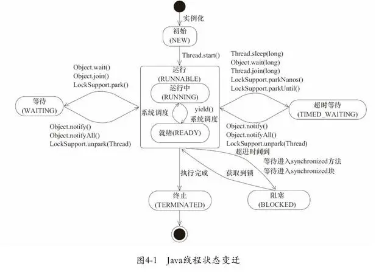
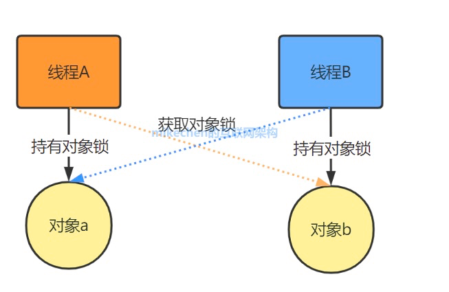

## 什么叫多线程？
多线程是一种并发编程的技术，它允许程序在同一个进程中同时执行多个独立的任务或操作。每个任务都由一个单独的线程来执行，而这些线程共享程序的资源和内存空间。

## 线程的状态

线程的状态一般看到的也就是Runable 和blocked ，最多的还是blocked，因为cpu的时间片很短，切换的很快等待IO，等待临界资源。



1. 初始(NEW):刚被创建,还没运行(未执行线程的start()方法)
2. 就绪状态(READY):线程在可运行线程池中,但未获得CPU执行权,和RUNNING并称运行 
3. 运行中状态(RUNNING):线程执行并获得CPU执行权,和READY并称运行
4. 阻塞(BLOCK):等待其他线程释放锁的状态
5. 等待(WAITING):需要其他线程做出一些约定好的动作,或被唤醒(通知或中断)
6. 超时等待(TIME_WAITING):和等待的不同点在于可以在指定的时间自行醒来
7. 终止(TERMENATED):线程已经执行完毕

## 线程的实现方式

方式	  | 优点                     | 缺点                       |
-------------- |------------------------|--------------------------|
实现Runnable或Callable接口 | 扩展性强，实现该接口还是继承其它类      | 编程相对复杂，不能直接使用Thread类中的方法。 |
继承Thread类 | 编程简单，直接可以使用Thread类中的方法 | 扩展性差，不能在继承其它类            |

## 多线程引入的问题
 多线程的优点很明显，但是线程的滥用会给系统带来上下文切换的额外负担，并且线程间的共享变量可能造成死锁的出现。
- 线程安全问题
  - 原子性：在并发编程中很多操作都不是原子操作
  ```java
    i++;
    i=j;
    i=i+1;
  ```
  在单线程环境中上面这三个操作不会出现问题，在多线程环境中，如果不加锁，可能会出现意想不到的结果。
  - 可见性： 当多个线程访问同一个变量时，一个线程修改了这个变量的值，其它线程能够立即得到修改的值。
   为了解决多线程的可见性问题，java提供volatile来实现。
- 死锁

 死锁的场景一般是：线程 A 和线程 B 都在互相等待对方释放锁，或者是其中某个线程在释放锁的时候出现异常如死循环之类的。这时就会导致系统不可用。

  

常用的解决方案如下：
  1. 尽量一个线程只获取一个锁。
  2. 一个线程只占用一个资源。 
  3. 尝试使用定时锁，至少能保证锁最终会被释放。

  
- 上下文切换

    多线程并不一定是要在多核处理器才支持的，就算是单核也是可以支持多线程的。
    CPU 通过给每个线程分配一定的时间片，由于时间非常短通常是几十毫秒，所以 CPU 可以不停的切换线程执行任务从而达到了多线程的效果。


> 上下文切换是非常耗效率的。

通常有以下解决方案:
1. 采用无锁编程，比如将数据按照 `Hash(id)` 进行取模分段，每个线程处理各自分段的数据，从而避免使用锁。 
2. 采用 CAS(compare and swap) 算法，如 `Atomic` 包就是采用 CAS 算法 
3. 合理的创建线程，避免创建了一些线程但其中大部分都是出于 `waiting` 状态，因为每当从 `waiting` 状态切换到 `running` 状态都是一次上下文切换。


## volatile变量原理
volatile在并发编程中很常见，但也容易被滥用，现在我们就进一步分析volatile关键字的语义。volatile是Java虚拟机提供的轻量级的同步机制。volatile关键字有如下两个作用

- 保证被volatile修饰的共享变量对所有线程总数可见的，也就是当一个线程修改了一个被volatile修饰共享变量的值，新值总数可以被其他线程立即得知。

- 禁止指令重排序优化。

**volatile的可见性**
关于volatile的可见性作用，我们必须意识到被volatile修饰的变量对所有线程总数立即可见的，对volatile变量的所有写操作总是能立刻反应到其他线程中，但是对于volatile变量运算操作在多线程环境并不保证安全性，如下

```java
public class VolatileVisibility {
    public static volatile int i =0;

    public static void increase(){
        i++;
    }
}
```
正如上述代码所示，i变量的任何改变都会立马反应到其他线程中，但是如此存在多条线程同时调用increase()方法的话，就会出现线程安全问题，毕竟i++;操作并不具备原子性，该操作是先读取值，然后写回一个新值，相当于原来的值加上1，分两步完成，如果第二个线程在第一个线程读取旧值和写回新值期间读取i的域值，那么第二个线程就会与第一个线程一起看到同一个值，并执行相同值的加1操作，这也就造成了线程安全失败，因此对于increase方法必须使用synchronized修饰，以便保证线程安全，需要注意的是一旦使用synchronized修饰方法后，由于synchronized本身也具备与volatile相同的特性，即可见性，因此在这样种情况下就完全可以省去volatile修饰变量。

```java
public class VolatileVisibility {
    public static int i =0;

    public synchronized static void increase(){
        i++;
    }
}
```
现在来看另外一种场景，可以使用volatile修饰变量达到线程安全的目的，如下：

```java
public class VolatileSafe {

    volatile boolean close;

    public void close(){
        close=true;
    }

    public void doWork(){
        while (!close){
            System.out.println("safe....");
        }
    }
}
```
由于对于boolean变量close值的修改属于原子性操作，因此可以通过使用volatile修饰变量close，使用该变量对其他线程立即可见，从而达到线程安全的目的。那么JMM是如何实现让volatile变量对其他线程立即可见的呢？实际上，当写一个volatile变量时，JMM会把该线程对应的工作内存中的共享变量值刷新到主内存中，当读取一个volatile变量时，JMM会把该线程对应的工作内存置为无效，那么该线程将只能从主内存中重新读取共享变量。volatile变量正是通过这种写-读方式实现对其他线程可见（但其内存语义实现则是通过内存屏障，稍后会说明）。

**volatile禁止重排优化**

volatile关键字另一个作用就是禁止指令重排优化，从而避免多线程环境下程序出现乱序执行的现象，关于指令重排优化前面已详细分析过，这里主要简单说明一下volatile是如何实现禁止指令重排优化的。先了解一个概念，内存屏障(Memory Barrier）。
内存屏障，又称内存栅栏，是一个CPU指令，它的作用有两个，一是保证特定操作的执行顺序，二是保证某些变量的内存可见性（利用该特性实现volatile的内存可见性）。由于编译器和处理器都能执行指令重排优化。如果在指令间插入一条Memory Barrier则会告诉编译器和CPU，不管什么指令都不能和这条Memory Barrier指令重排序，也就是说通过插入内存屏障禁止在内存屏障前后的指令执行重排序优化。Memory Barrier的另外一个作用是强制刷出各种CPU的缓存数据，因此任何CPU上的线程都能读取到这些数据的最新版本。总之，volatile变量正是通过内存屏障实现其在内存中的语义，即可见性和禁止重排优化。下面看一个非常典型的禁止重排优化的例子DCL，如下：

```java

public class DoubleCheckLock {

    private static DoubleCheckLock instance;

    private DoubleCheckLock(){}

    public static DoubleCheckLock getInstance(){

        //第一次检测
        if (instance==null){
            //同步
            synchronized (DoubleCheckLock.class){
                if (instance == null){
                    //多线程环境下可能会出现问题的地方
                    instance = new DoubleCheckLock();
                }
            }
        }
        return instance;
    }
}
```
上述代码一个经典的单例的双重检测的代码，这段代码在单线程环境下并没有什么问题，但如果在多线程环境下就可以出现线程安全问题。原因在于某一个线程执行到第一次检测，读取到的instance不为null时，instance的引用对象可能没有完成初始化。因为instance = new DoubleCheckLock();可以分为以下3步完成(伪代码)

```java
memory = allocate(); //1.分配对象内存空间
instance(memory);    //2.初始化对象
instance = memory;   //3.设置instance指向刚分配的内存地址，此时instance！=null
```
由于步骤1和步骤2间可能会重排序，如下：

```java
memory = allocate(); //1.分配对象内存空间
instance = memory;   //3.设置instance指向刚分配的内存地址，此时instance！=null，但是对象还没有初始化完成！
instance(memory);    //2.初始化对象
```
由于步骤2和步骤3不存在数据依赖关系，而且无论重排前还是重排后程序的执行结果在单线程中并没有改变，因此这种重排优化是允许的。但是指令重排只会保证串行语义的执行的一致性(单线程)，但并不会关心多线程间的语义一致性。所以当一条线程访问instance不为null时，由于instance实例未必已初始化完成，也就造成了线程安全问题。那么该如何解决呢，很简单，我们使用volatile禁止instance变量被执行指令重排优化即可。

```java
  //禁止指令重排优化
  private volatile static DoubleCheckLock instance;
```
总之，JMM就是一组规则，这组规则意在解决在并发编程可能出现的线程安全问题，并提供了内置解决方案（happen-before原则）及其外部可使用的同步手段(synchronized/volatile等)，确保了程序执行在多线程环境中的应有的原子性，可视性及其有序性。


## ThreadLocal 的应用及源码解析

ThreadLocal 又称为线程本地存储区（Thread Local Storage，简称为 TLS），每个线程都有自己的私有的本地存储区域，不同线程之间彼此不能访问对方的 TLS 区域。使用 ThreadLocal 变量 的 set(T value)方法 可以将数据存入 该线程本地存储区，使用 get() 方法 可以获取到之前存入的值。

### ThreadLocal 的常见应用

不使用 ThreadLocal。

```java
public class SessionBean {
    public static class Session {
        private String id;
        public String getId() {
            return id;
        }
        public void setId(String id) {
            this.id = id;
        }
    }

    public Session createSession() {
        return new Session();
    }

    public void setId(Session session, String id) {
        session.setId(id);
    }
    public String getId(Session session) {
        return session.getId();
    }
    public static void main(String[] args) {
    //没有使用ThreadLocal，在方法间共享session需要进行session在方法间的传递
        new Thread(() -> {
            SessionBean bean = new SessionBean();
            Session session = bean.createSession();
            bean.setId(session, "susan");
            System.out.println(bean.getId(session));
        }).start();
    }
}
```

上述代码中，session 需要在方法间传递才可以修改和读取，保证线程中各方法操作的是一个。下面看一下使用 ThreadLocal 的代码。

```java
public class SessionBean {
//定义一个静态ThreadLocal变量session，就能够保证各个线程有自己的一份，并且方法可以方便获取，不用传递
    private static ThreadLocal<Session> session = new ThreadLocal<>();
    public static class Session {
        private String id;
        public String getId() {
            return id;
        }
        public void setId(String id) {
            this.id = id;
        }
    }

    public void createSession() {
        session.set(new Session());
    }

    public void setId(String id) {
        session.get().setId(id);
    }

    public String getId() {
        return session.get().getId();
    }

    public static void main(String[] args) {
        new Thread(() -> {
            SessionBean bean = new SessionBean();
            bean.createSession();
            bean.setId("susan");
            System.out.println(bean.getId());
        }).start();
    }
}
```

在方法的内部实现中，直接可以通过 session.get() 获取到当前线程的 session，省掉了参数在方法间传递的环节。

### ThreadLocal 的实现原理

一般，类属性中的数据是多个线程共享的，但 ThreadLocal 类型的数据 声明为类属性，却可以为每一个使用它（通过 set(T value)方法）的线程存储 线程私有的数据，通过其源码我们可以发现其中的原理。

```java
public class ThreadLocal<T> {

    /**
     * 下面的 getMap()方法 传入当前线程，获得一个ThreadLocalMap对象，说明每一个线程维护了
     * 自己的一个 map，保证读取出来的value是自己线程的。
     *
     * ThreadLocalMap 是ThreadLocal静态内部类，存储value的键值就是ThreadLocal本身。
     *
     * 因此可以断定，每个线程维护一个ThreadLocalMap的键值对映射Map。不同线程的Map的 key值 是一样的，
     * 都是ThreadLocal，但 value 是不同的。
     */
    public T get() {
        Thread t = Thread.currentThread();
        ThreadLocalMap map = getMap(t);
        if (map != null) {
            ThreadLocalMap.Entry e = map.getEntry(this);
            if (e != null) {
                @SuppressWarnings("unchecked")
                T result = (T)e.value;
                return result;
            }
        }
        return setInitialValue();
    }

    public void set(T value) {
        Thread t = Thread.currentThread();
        ThreadLocalMap map = getMap(t);
        if (map != null)
            map.set(this, value);
        else
            createMap(t, value);
    }
}
```

### ThreadLocal 在 Spring 中的使用

Spring 事务处理的设计与实现中大量使用了 ThreadLocal 类，比如，TransactionSynchronizationManager 维护了一系列的 ThreadLocal 变量，用于存储线程私有的 事务属性及资源。源码如下。

```java
/**
 * 管理每个线程的资源和事务同步的中心帮助程序。供资源管理代码使用，但不供典型应用程序代码使用。
 *
 * 资源管理代码应该检查线程绑定的资源，如，JDBC连接 或 Hibernate Sessions。
 * 此类代码通常不应该将资源绑定到线程，因为这是事务管理器的职责。另一个选项是，
 * 如果事务同步处于活动状态，则在首次使用时延迟绑定，以执行跨任意数量资源的事务。
 */
public abstract class TransactionSynchronizationManager {

	/**
	 *  一般是一个线程持有一个 独立的事务，以相互隔离地处理各自的事务。
	 *  所以这里使用了很多 ThreadLocal对象，为每个线程绑定 对应的事务属性及资源，
	 *  以便后续使用时能直接获取。
	 */
	private static final ThreadLocal<Map<Object, Object>> resources =
			new NamedThreadLocal<Map<Object, Object>>("Transactional resources");

	private static final ThreadLocal<Set<TransactionSynchronization>> synchronizations =
			new NamedThreadLocal<Set<TransactionSynchronization>>("Transaction synchronizations");

	private static final ThreadLocal<String> currentTransactionName =
			new NamedThreadLocal<String>("Current transaction name");

	private static final ThreadLocal<Boolean> currentTransactionReadOnly =
			new NamedThreadLocal<Boolean>("Current transaction read-only status");

	private static final ThreadLocal<Integer> currentTransactionIsolationLevel =
			new NamedThreadLocal<Integer>("Current transaction isolation level");

	private static final ThreadLocal<Boolean> actualTransactionActive =
			new NamedThreadLocal<Boolean>("Actual transaction active");

	/**
	 * 为当前线程 绑定 对应的resource资源
	 */
	public static void bindResource(Object key, Object value) throws IllegalStateException {
		Object actualKey = TransactionSynchronizationUtils.unwrapResourceIfNecessary(key);
		Assert.notNull(value, "Value must not be null");
		Map<Object, Object> map = resources.get();
		// 如果当前线程的 resources中，绑定的数据map为空，则为 resources 绑定 map
		if (map == null) {
			map = new HashMap<Object, Object>();
			resources.set(map);
		}
		Object oldValue = map.put(actualKey, value);
		if (oldValue instanceof ResourceHolder && ((ResourceHolder) oldValue).isVoid()) {
			oldValue = null;
		}
		if (oldValue != null) {
			throw new IllegalStateException("Already value [" + oldValue + "] for key [" +
					actualKey + "] bound to thread [" + Thread.currentThread().getName() + "]");
		}
		if (logger.isTraceEnabled()) {
			logger.trace("Bound value [" + value + "] for key [" + actualKey + "] to thread [" +
					Thread.currentThread().getName() + "]");
		}
	}

	/**
	 * 返回当前线程绑定的所有资源
	 */
	public static Map<Object, Object> getResourceMap() {
		Map<Object, Object> map = resources.get();
		return (map != null ? Collections.unmodifiableMap(map) : Collections.emptyMap());
	}
}
```

### ThreadLocal 在 Mybatis 中的使用

Mybatis 的 SqlSession 对象 也是各线程私有的资源，所以对其的管理也使用到了 ThreadLocal 类。源码如下。

```java
public class SqlSessionManager implements SqlSessionFactory, SqlSession {

  private final ThreadLocal<SqlSession> localSqlSession = new ThreadLocal<>();

  public void startManagedSession() {
    this.localSqlSession.set(openSession());
  }

  public void startManagedSession(boolean autoCommit) {
    this.localSqlSession.set(openSession(autoCommit));
  }

  public void startManagedSession(Connection connection) {
    this.localSqlSession.set(openSession(connection));
  }

  public void startManagedSession(TransactionIsolationLevel level) {
    this.localSqlSession.set(openSession(level));
  }

  public void startManagedSession(ExecutorType execType) {
    this.localSqlSession.set(openSession(execType));
  }

  public void startManagedSession(ExecutorType execType, boolean autoCommit) {
    this.localSqlSession.set(openSession(execType, autoCommit));
  }

  public void startManagedSession(ExecutorType execType, TransactionIsolationLevel level) {
    this.localSqlSession.set(openSession(execType, level));
  }

  public void startManagedSession(ExecutorType execType, Connection connection) {
    this.localSqlSession.set(openSession(execType, connection));
  }

  public boolean isManagedSessionStarted() {
    return this.localSqlSession.get() != null;
  }

  @Override
  public Connection getConnection() {
    final SqlSession sqlSession = localSqlSession.get();
    if (sqlSession == null) {
      throw new SqlSessionException("Error:  Cannot get connection.  No managed session is started.");
    }
    return sqlSession.getConnection();
  }

  @Override
  public void clearCache() {
    final SqlSession sqlSession = localSqlSession.get();
    if (sqlSession == null) {
      throw new SqlSessionException("Error:  Cannot clear the cache.  No managed session is started.");
    }
    sqlSession.clearCache();
  }

  @Override
  public void commit() {
    final SqlSession sqlSession = localSqlSession.get();
    if (sqlSession == null) {
      throw new SqlSessionException("Error:  Cannot commit.  No managed session is started.");
    }
    sqlSession.commit();
  }

  @Override
  public void commit(boolean force) {
    final SqlSession sqlSession = localSqlSession.get();
    if (sqlSession == null) {
      throw new SqlSessionException("Error:  Cannot commit.  No managed session is started.");
    }
    sqlSession.commit(force);
  }

  @Override
  public void rollback() {
    final SqlSession sqlSession = localSqlSession.get();
    if (sqlSession == null) {
      throw new SqlSessionException("Error:  Cannot rollback.  No managed session is started.");
    }
    sqlSession.rollback();
  }

  @Override
  public void rollback(boolean force) {
    final SqlSession sqlSession = localSqlSession.get();
    if (sqlSession == null) {
      throw new SqlSessionException("Error:  Cannot rollback.  No managed session is started.");
    }
    sqlSession.rollback(force);
  }

  @Override
  public List<BatchResult> flushStatements() {
    final SqlSession sqlSession = localSqlSession.get();
    if (sqlSession == null) {
      throw new SqlSessionException("Error:  Cannot rollback.  No managed session is started.");
    }
    return sqlSession.flushStatements();
  }

  @Override
  public void close() {
    final SqlSession sqlSession = localSqlSession.get();
    if (sqlSession == null) {
      throw new SqlSessionException("Error:  Cannot close.  No managed session is started.");
    }
    try {
      sqlSession.close();
    } finally {
      localSqlSession.set(null);
    }
  }
}
```
### 思考

- ThreadLocal会出现内存泄露情况吗？
