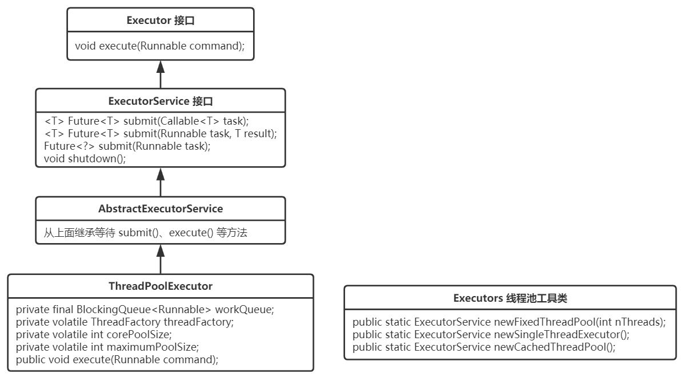
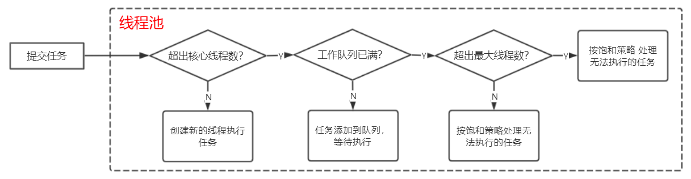

## 前言
线程池是一种多线程开发的处理方式，线程池可以方便得对线程进行创建，执行、销毁和管理等操作。主要用来解决需要异步或并发执行任务的程序。
## 1. 线程池的作用
- 降低资源消耗。通过重复利用已创建的线程降低线程创建和销毁造成的消耗。
- 提高响应速度。当任务到达时，任务可以不需要等到线程创建就能立即执行。
- 提高线程的可管理性。线程是稀缺资源，如果无限制地创建，不仅会消耗系统资源，
还会降低系统的稳定性，使用线程池可以进行统一分配、调优和监控。但是，要做到合理利用线程池，必须对其实现原理了如指掌。
## 2. 线程池核心组件图解

看源码之前，先了解一下该组件 最主要的几个 接口、抽象类和实现类的结构关系。



该组件中，Executor 和 ExecutorService 接口 定义了线程池最核心的几个方法，提交任务 submit
()、关闭线程池 shutdown()。抽象类 AbstractExecutorService 主要对公共行为 submit()系列方法进行了实现，这些 submit()方法 的实现使用了 模板方法模式，其中调用的 execute()方法 是未实现的 来自 Executor 接口 的方法。实现类 ThreadPoolExecutor 则对线程池进行了具体而复杂的实现。

另外还有一个常见的工具类 Executors，里面为开发者封装了一些可以直接拿来用的线程池。

## 3. 源码赏析

话不多说，直接上源码。（这里只看最主要的代码部分）

### 4. Executor 和 ExecutorService 接口

```java
public interface Executor {

    /**
     * 在将来的某个时间执行给定的 Runnable。该 Runnable 可以在新线程、池线程或调用线程中执行。
     */
    void execute(Runnable command);
}

public interface ExecutorService extends Executor {

    /**
     * 优雅关闭，该关闭会继续执行完以前提交的任务，但不再接受新任务。
     */
    void shutdown();

    /**
     * 提交一个有返回值的任务，并返回该任务的 未来执行完成后的结果。
     * Future的 get()方法 将在成功完成后返回任务的结果。
     */
    <T> Future<T> submit(Callable<T> task);

    <T> Future<T> submit(Runnable task, T result);

    Future<?> submit(Runnable task);
}
```

### 5. AbstractExecutorService 抽象类

```java
/**
 * 该抽象类最主要的内容就是，实现了 ExecutorService 中的 submit()系列方法
 */
public abstract class AbstractExecutorService implements ExecutorService {

    /**
     * 提交任务 进行执行，返回获取未来结果的 Future对象。
     * 这里使用了 “模板方法模式”，execute()方法来自 Executor接口，该抽象类中并未进行实现，
     * 而是交由子类具体实现。
     */
    public Future<?> submit(Runnable task) {
        if (task == null) throw new NullPointerException();
        RunnableFuture<Void> ftask = newTaskFor(task, null);
        execute(ftask);
        return ftask;
    }

    public <T> Future<T> submit(Runnable task, T result) {
        if (task == null) throw new NullPointerException();
        RunnableFuture<T> ftask = newTaskFor(task, result);
        execute(ftask);
        return ftask;
    }

    public <T> Future<T> submit(Callable<T> task) {
        if (task == null) throw new NullPointerException();
        RunnableFuture<T> ftask = newTaskFor(task);
        execute(ftask);
        return ftask;
    }
}
```

### 6. ThreadPoolExecutor

```java
public class ThreadPoolExecutor extends AbstractExecutorService {

    /**
     * **************
     * ** 主要属性 **
     * **************
     */

	/** 阻塞队列 */
    private final BlockingQueue<Runnable> workQueue;

    /** 用于创建线程的 线程工厂 */
    private volatile ThreadFactory threadFactory;

    /** 核心线程数 */
    private volatile int corePoolSize;

    /** 最大线程数 */
    private volatile int maximumPoolSize;


    /**
     * **************
     * ** 构造方法 **
     * **************
     */

    /** 最后都使用了最后一个构造方法的实现 */
    public ThreadPoolExecutor(int corePoolSize,
                              int maximumPoolSize,
                              long keepAliveTime,
                              TimeUnit unit,
                              BlockingQueue<Runnable> workQueue) {
        this(corePoolSize, maximumPoolSize, keepAliveTime, unit, workQueue,
             Executors.defaultThreadFactory(), defaultHandler);
    }

    public ThreadPoolExecutor(int corePoolSize,
                              int maximumPoolSize,
                              long keepAliveTime,
                              TimeUnit unit,
                              BlockingQueue<Runnable> workQueue,
                              ThreadFactory threadFactory) {
        this(corePoolSize, maximumPoolSize, keepAliveTime, unit, workQueue,
             threadFactory, defaultHandler);
    }

    public ThreadPoolExecutor(int corePoolSize,
                              int maximumPoolSize,
                              long keepAliveTime,
                              TimeUnit unit,
                              BlockingQueue<Runnable> workQueue,
                              RejectedExecutionHandler handler) {
        this(corePoolSize, maximumPoolSize, keepAliveTime, unit, workQueue,
             Executors.defaultThreadFactory(), handler);
    }

    public ThreadPoolExecutor(int corePoolSize,
                              int maximumPoolSize,
                              long keepAliveTime,
                              TimeUnit unit,
                              BlockingQueue<Runnable> workQueue,
                              ThreadFactory threadFactory,
                              RejectedExecutionHandler handler) {
        if (corePoolSize < 0 ||
            maximumPoolSize <= 0 ||
            maximumPoolSize < corePoolSize ||
            keepAliveTime < 0)
            throw new IllegalArgumentException();
        if (workQueue == null || threadFactory == null || handler == null)
            throw new NullPointerException();
        this.corePoolSize = corePoolSize;
        this.maximumPoolSize = maximumPoolSize;
        this.workQueue = workQueue;
        this.keepAliveTime = unit.toNanos(keepAliveTime);
        this.threadFactory = threadFactory;
        this.handler = handler;
    }

    /**
     * **************
     * ** 主要实现 **
     * **************
     */

	/** 执行 Runnable任务 */
    public void execute(Runnable command) {
        if (command == null)
            throw new NullPointerException();
        /*
         * 分三步进行：
         *
         * 1、如果运行的线程少于 corePoolSize，尝试开启一个新的线程；否则尝试进入工作队列
         *
         * 2. 如果工作队列没满，则进入工作队列；否则 判断是否超出最大线程数
         *
         * 3. 如果未超出最大线程数，则尝试开启一个新的线程；否则 按饱和策略处理无法执行的任务
         */
        int c = ctl.get();
        if (workerCountOf(c) < corePoolSize) {
            if (addWorker(command, true))
                return;
            c = ctl.get();
        }
        if (isRunning(c) && workQueue.offer(command)) {
            int recheck = ctl.get();
            if (! isRunning(recheck) && remove(command))
                reject(command);
            else if (workerCountOf(recheck) == 0)
                addWorker(null, false);
        }
        else if (!addWorker(command, false))
            reject(command);
    }

    /**
     * 优雅关闭，在其中执行以前提交的任务，但不接受新任务。如果已关闭，则调用没有其他效果。
     */
    public void shutdown() {
        final ReentrantLock mainLock = this.mainLock;
        mainLock.lock();
        try {
            checkShutdownAccess();
            advanceRunState(SHUTDOWN);
            interruptIdleWorkers();
            onShutdown(); // hook for ScheduledThreadPoolExecutor
        } finally {
            mainLock.unlock();
        }
        tryTerminate();
    }
}
```

ThreadPoolExecutor 中的 execute()方法 执行 Runnable 任务 的流程逻辑可以用下图表示。



### 7. 工具类 Executors

看类名也知道，它最主要的作用就是提供 static 的工具方法，为开发者提供各种封装好的 具有各自特性的线程池。

```java
public class Executors {

    /**
     * 创建一个固定线程数量的线程池
     */
    public static ExecutorService newFixedThreadPool(int nThreads) {
        return new ThreadPoolExecutor(nThreads, nThreads,
                                      0L, TimeUnit.MILLISECONDS,
                                      new LinkedBlockingQueue<Runnable>());
    }

    /**
     * 创建一个单线程的线程池
     */
    public static ExecutorService newSingleThreadExecutor() {
        return new FinalizableDelegatedExecutorService
            (new ThreadPoolExecutor(1, 1,
                                    0L, TimeUnit.MILLISECONDS,
                                    new LinkedBlockingQueue<Runnable>()));
    }

    /**
     * 创建一个缓存的，可动态伸缩的线程池。
     * 可以看出来：核心线程数为0，最大线程数为Integer.MAX_VALUE，如果任务数在某一瞬间暴涨，
     * 这个线程池很可能会把 服务器撑爆。
     * 另外需要注意的是，它们底层都是使用了 ThreadPoolExecutor，只不过帮我们配好了参数
     */
    public static ExecutorService newCachedThreadPool() {
        return new ThreadPoolExecutor(0, Integer.MAX_VALUE,
                                      60L, TimeUnit.SECONDS,
                                      new SynchronousQueue<Runnable>());
    }
}
```

## 8. 任务队列（BlockingQueue）
### 8.1 直接提交的任务队列（SynchronousQueue）
- SynchronousQueue没有容量。
-提交的任务不会被真实的保存在队列中，而总是将新任务提交给线程执行。如果没有空闲的线程，则尝试创建新的线程。如果线程数大于最大值maximumPoolSize，则执行拒绝策略。

### 8.2 有界的任务队列（ArrayBlockingQueue）
- 创建队列时，指定队列的最大容量。
- 若有新的任务要执行，如果线程池中的线程数小于corePoolSize，则会优先创建新的线程。若大于corePoolSize，则会将新任务加入到等待队列中。
- 若等待队列已满，无法加入。如果总线程数不大于线程数最大值maximumPoolSize，则创建新的线程执行任务。若大于maximumPoolSize，则执行拒绝策略。

### 8.3 无界的任务队列（LinkedBlockingQueue）
- 与有界队列相比，除非系统资源耗尽，否则不存在任务入队失败的情况。
- 若有新的任务要执行，如果线程池中的线程数小于corePoolSize，线程池会创建新的线程。若大于corePoolSize，此时又没有空闲的线程资源，则任务直接进入等待队列。
- 当线程池中的线程数达到corePoolSize后，线程池不会创建新的线程。
- 若任务创建和处理的速度差异很大，无界队列将保持快速增长，直到耗尽系统内存。
- 使用无界队列将导致在所有 corePoolSize 线程都忙时，新任务在队列中等待。这样，创建的线程就不会超过 corePoolSize（因此，maximumPoolSize 的值也就无效了）。当每个任务完全独立于其他任务，即任务执行互不影响时，适合于使用无界队列；例如，在 Web 页服务器中。这种排队可用于处理瞬态突发请求，当命令以超过队列所能处理的平均数连续到达时，此策略允许无界线程具有增长的可能性。

### 8.4 优先任务队列（PriorityBlockingQueue）
- 带有执行优先级的队列。是一个特殊的无界队列。
- ArrayBlockingQueue和LinkedBlockingQueue都是按照先进先出算法来处理任务。而PriorityBlockingQueue可根据任务自身的优先级顺序先后执行（总是确保高优先级的任务先执行）。

## 9. 线程池参数配置
- 线程池的默认值
  - corePoolSize=1
  - queueCapacity=Integer.MAX_VALUE
  - maxPoolSize=Integer.MAX_VALUE
  - keepAliveTime=60s
  - allowCoreThreadTimeout=false
  - rejectedExcutionHandler=AbortPolicy()

- 核心线程数：如果任务是 CPU 密集型，即计算任务比较多，可以设置线程数为核心数+1，这样可以让 CPU 资源得到充分利用。如果任务是 IO 密集型，即网络请求比较多，可以根据实际情况设置线程数，一般可以设置为 2 * 核心数。
- 最大线程数：最大线程数一般设置为 2 * 核心线程数，可以根据实际情况调整。
- 阻塞队列大小：如果任务是 CPU 密集型，即计算任务比较多，可以将队列大小设置为 0 或者 1，这样可以让线程池及时处理任务，避免任务堆积。如果任务是 IO 密集型，即网络请求比较多，可以设置队列大小为 2 * 核心线程数，这样可以缓存一些请求，避免线程池因为等待 IO 密集型任务而阻塞。
- 动态调整：可以根据实际情况动态调整线程池的核心数、最大线程数和队列大小，比如根据系统负载、CPU 使用率、任务执行时间等指标来调整。
- 监控和优化：可以通过监控线程池的运行状况，比如任务的平均响应时间、任务的完成数量等指标来优化线程池的配置，从而提高吞吐量。
  

## 10. 线程池的使用场景

- 并发任务处理：线程池可以用于处理并发的任务，例如处理请求、批量处理数据、并行计算等。通过线程池，可以管理和复用线程，提高任务的执行效率。
- 异步任务执行：线程池可以用于执行异步任务，将任务提交给线程池后，可以立即返回并继续执行后续代码，不必等待任务完成。适用于需要在后台执行耗时任务，同时不阻塞主线程的场景。
- 定时任务调度：线程池提供了定时任务执行的功能，可以周期性地执行任务或在指定的时间点执行任务。适用于需要按计划执行任务的场景，例如定时任务、定时检查等。
- 资源池管理：线程池可以用于管理资源池，例如数据库连接池、线程池等。通过线程池，可以复用和管理资源，提高资源利用率，同时控制资源的并发访问。
- 并行计算：线程池可以用于并行计算，将计算任务分解为多个子任务，分配给线程池中的线程并行执行，加速计算过程。适用于需要高性能并行计算的场景，如数据处理、图像处理等。
- 长时间运行的任务：线程池适用于长时间运行的任务，可以控制线程的生命周期，避免频繁创建和销毁线程的开销，提高系统的稳定性和性能。

## 11. ForkJoin框架

JDK1.7引入了ForkJoin框架。ForkJoin框架允许其他线程向其提交任务，并将任务拆分成粒度更细的子任务，这些子任务由ForkJoin框架内部的工作线程来并行执行，并且这些工作线程之间可以互相窃取任务执行。

ForkJoin框架主要包含两部分：

- 分治任务的线程池ForkJoinPool类；
- 分治任务ForkJoinTask类。

### 11.1 ForkJoinPool

ForkJoinPool是用于执行ForkJoinTask任务的执行池，继承了AbstractExecutorService类。ForkJoinPool的构造函数有多个，此处我们介绍其中参数最全的一个，其实现如下：
```java
    public ForkJoinPool(int parallelism,
                    ForkJoinWorkerThreadFactory factory,
                    UncaughtExceptionHandler handler,
                    boolean asyncMode) {
        this(checkParallelism(parallelism),
         checkFactory(factory),
         handler,
         asyncMode ? FIFO_QUEUE : LIFO_QUEUE,
         "ForkJoinPool-" + nextPoolId() + "-worker-");
        checkPermission();
    }
``` 
- parallelism：表示指令的并行级别，ForkJoinPool将根据这个值来决定工作线程的数量，默认使用Runtime.getRuntime().availableProcessors()来设置；
- factory：ForkJoinPool内部创建线程使用的线程工厂，需要注意的是，此处的线程工厂的类型是ForkJoinWorkerThreadFactory而不是ThreadFactory，默认使用DefaultForkJoinWorkerThreadFactory；
- handler：异常处理器，主要用于处理任务运行中出现的异常；
- asyncMode：队列的工作模式，为true时使用先进先出模式，为false时使用先进后出模式。

使用 ForkJoin 框架，必须首先创建一个 ForkJoin 任务。它提供在任务中执行 fork() 和 join() 操作的机制，通常情况下我们不需要直接继承 ForkJoinTask 类，而只需要继承它的子类。

Fork/Join 框架提供了以下两个子类：
- RecursiveAction：用于没有返回结果的任务。(比如写数据到磁盘，然后就退出了。 一个RecursiveAction可以把自己的工作分割成更小的几块， 这样它们可以由独立的线程或者CPU执行。 我们可以通过继承来实现一个RecursiveAction)
- RecursiveTask ：用于有返回结果的任务。(可以将自己的工作分割为若干更小任务，并将这些子任务的执行合并到一个集体结果。 可以有几个水平的分割和合并)

## 思考

- 线程池ForkJoinPool和传统的线程池ThreadPoolExecutor有什么区别？