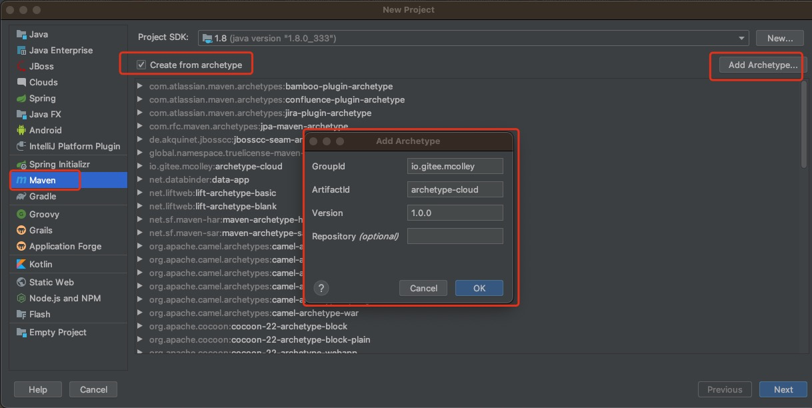
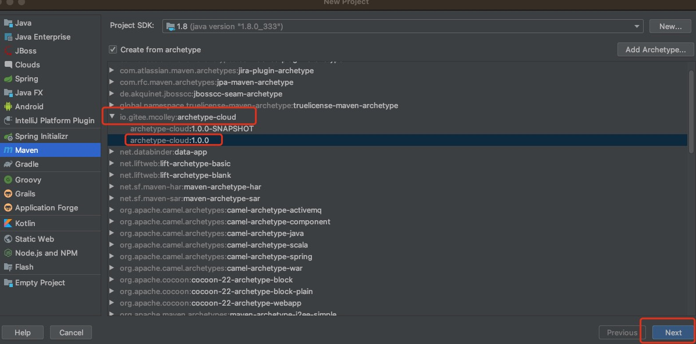
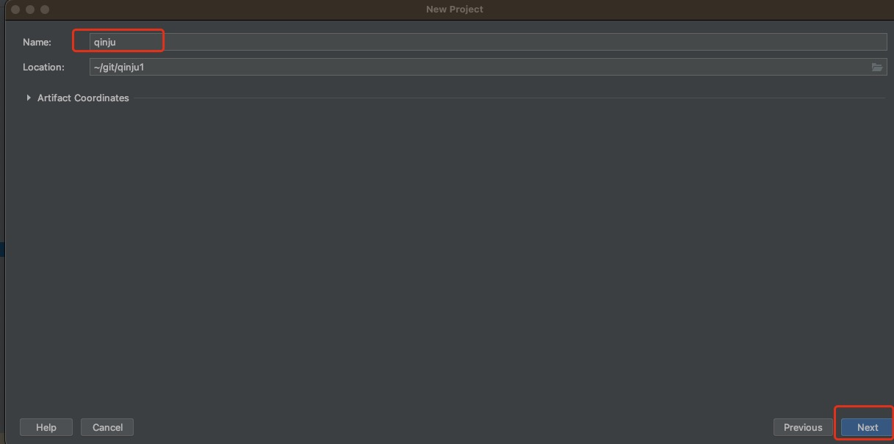
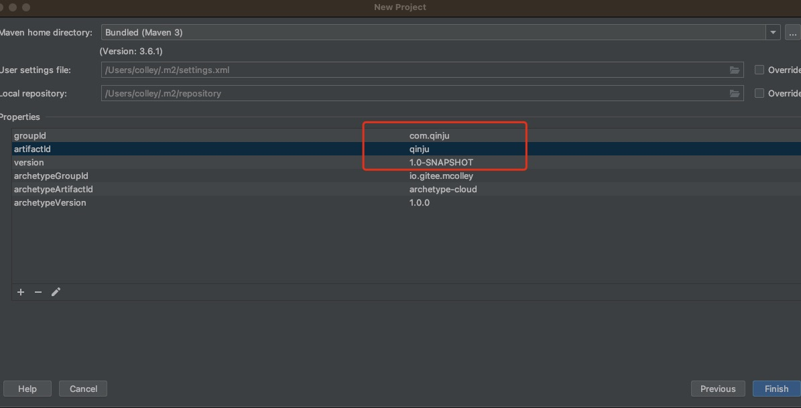
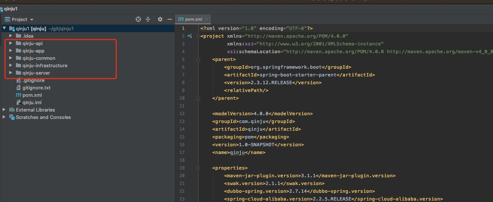
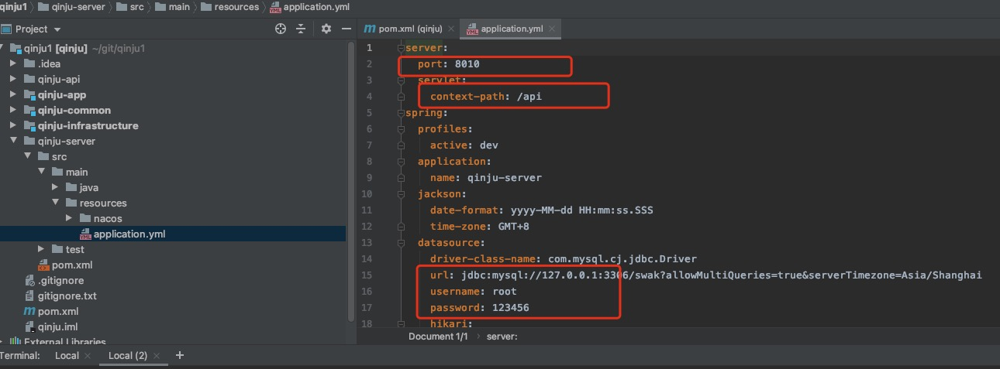
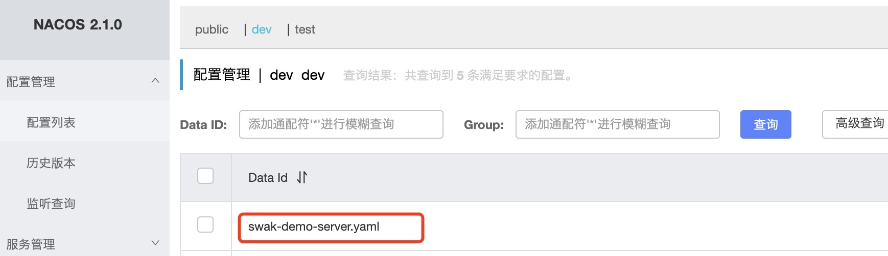
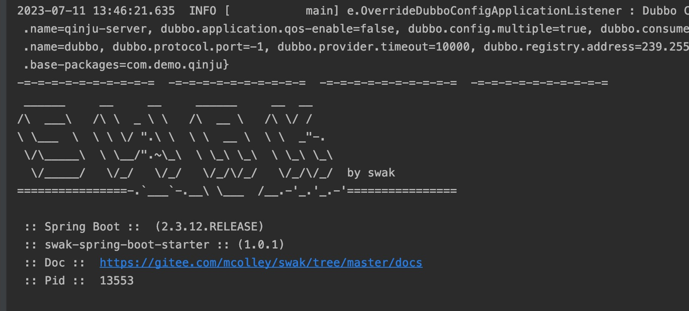

## 准备工作
```xml
JDK >= 1.8 (推荐1.8版本)
Mysql >= 5.7.0 (推荐5.7版本)
Maven >= 3.6.1
```
### 开发环境搭建
#### 开发工具
 swak采用idea作为开发工具。但不局限于idea。此处仅介绍在idea搭建开发环境所需的操作。

### 脚手架生成项目
####  命令行方式

```shell
语法:
mvn archetype:generate \
-DarchetypeGroupId=io.gitee.mcolley \
-DarchetypeArtifactId=archetype-cloud \
-DarchetypeVersion=1.0.0 \
-DgroupId=com.qinju \
-DartifactId=qinju \
-Dversion=1.0.0.SNAPSHOT \
-Dpackage=com.qinju \
-DinteractiveMode=false
```
参数 | 说明 | 备注 | 示例
------ | ---- | ---- | ----
groupId | 新建项目groupId | | com.qinju
artifactId | 新建项目artifactId	| | qinju
package | 新建项目基础包 |	| com.qinju
version | 新建项目版本号 | | 1.0.0-SNAPSHOT
archetypeGroupId |  脚手架的groupId | io.gitee.mcolley |
archetypeArtifactId | 脚手架的artifactId | archetype-cloud |
archetypeVersion | 脚手架的版本 | 目前暂无版本迭代固定1.0.0 | 1.0.0

```shell
完整示例:
mvn archetype:generate \
-DarchetypeGroupId=io.gitee.mcolley \
-DarchetypeArtifactId=archetype-cloud \
-DarchetypeVersion=1.0.0 \
-DgroupId=com.qinju \
-DartifactId=qinju \
-Dversion=1.0.0.SNAPSHOT \
-Dpackage=com.qinju \
-DinteractiveMode=false
```

#### 2.2 IDE工具
1. 安装插件（Maven Archetype Catalogs） 选择对应的脚手架创建自己的项目











项目结构如下：
```xml
├── pom.xml
├── qinju-api
├── qinju-app
├── qinju-common
├── qinju-infrastructure
├── qinju-server

```
###  运行项目系统

#### 修改数据库连接
qinju-server目录下src/main/resources 中application.yml修改数据库的url、userName以及password以及执行sql中mysql.sql。
```sql
drop table if exists sys_user;
CREATE TABLE `sys_user` (
  `id` bigint(20) NOT NULL AUTO_INCREMENT COMMENT '用户ID',
  `dept_id` bigint(20) DEFAULT NULL COMMENT '部门ID',
  `login_name` varchar(30) NOT NULL COMMENT '登录账号',
  `user_name` varchar(30) DEFAULT '' COMMENT '用户昵称',
  `user_type` varchar(2) DEFAULT '00' COMMENT '用户类型（00系统用户 01注册用户）',
  `email` varchar(50) DEFAULT '' COMMENT '用户邮箱',
  `phone` varchar(11) DEFAULT '' COMMENT '手机号码',
  `sex` char(1) DEFAULT '0' COMMENT '用户性别（0男 1女 2未知）',
  `avatar` varchar(100) DEFAULT '' COMMENT '头像路径',
  `password` varchar(50) DEFAULT '' COMMENT '密码',
  `salt` varchar(20) DEFAULT '' COMMENT '盐加密',
  `status` char(1) DEFAULT '0' COMMENT '帐号状态（0正常 1停用）',
  `del_flag` char(1) DEFAULT '0' COMMENT '删除标志（0代表存在 2代表删除）',
  `login_ip` varchar(128) DEFAULT '' COMMENT '最后登录IP',
  `login_date` datetime DEFAULT NULL COMMENT '最后登录时间',
  `pwd_update_date` datetime DEFAULT NULL COMMENT '密码最后更新时间',
  `remark` varchar(500) DEFAULT NULL COMMENT '备注',
  `creator_id` varchar(64) CHARACTER SET utf8 NOT NULL COMMENT '创建人ID',
  `create_time` datetime NOT NULL COMMENT '创建时间',
  `modifier_id` varchar(64) CHARACTER SET utf8 DEFAULT NULL COMMENT '修改人ID',
  `modify_time` datetime DEFAULT NULL ON UPDATE CURRENT_TIMESTAMP COMMENT '修改时间',
  PRIMARY KEY (`id`) USING BTREE,
  UNIQUE KEY `uniq_lgname` (`login_name`) USING BTREE
) ENGINE=InnoDB AUTO_INCREMENT=2 DEFAULT CHARSET=utf8mb4 COMMENT='用户信息表';

INSERT INTO `sys_user` (`id`, `dept_id`, `login_name`, `user_name`, `user_type`, `email`, `phone`, `sex`, `avatar`, `password`, `salt`, `status`, `del_flag`, `login_ip`, `login_date`, `pwd_update_date`, `remark`, `creator_id`, `create_time`, `modifier_id`, `modify_time`) VALUES (1, 103, 'admin', 'swak', '00', 'swak@swak.com', '15888888888', '1', '', '29c67a30398638269fe600f73a054934', '111111', '0', '0', '127.0.0.1', '2023-07-09 09:39:57', '2023-07-09 09:39:57', '管理员', '1', now(), NULL, NULL);

```

####  普通Web开发环境配置
编辑src/main/resources目录下的中application.yml 文件，默认端口为8010,contextpath=/api



#### 微服开发环境配置
删掉application.yml，然后把nacos/bootstrap.yml 复制到src/main/resources目录下
配置安装的nacos地址
nacos中配置对应的 qinju-server.yml

```yml
server:
  port: 8010
  servlet:
    context-path: /api/demo
spring:
  datasource:
    driver-class-name: com.mysql.cj.jdbc.Driver
    url: jdbc:mysql://127.0.0.1:3306/swak?allowMultiQueries=true&serverTimezone=Asia/Shanghai
    username: root
    password: 123456
    hikari:
      minimum-idle: 5
      maximum-pool-size: 100
      idle-timeout: 600000
      max-lifetime: 3600000
      connection-timeout: 60000
      connection-test-query: SELECT 1
dubbo:
  scan:
    base-packages: com.qinju
  protocol:
    name: dubbo
    port: -1
  registry:
    address: nacos://${nacos.address}?namespace=${nacos.discovery-namespace}
  provider:
    timeout: 10000
  consumer:
    check: false
    loadbalance: roundrobin

```

####  启动及验证
启动SwakBootApplication.java 出现如下图表示启动成功



打开浏览器，输入：http://localhost:8010/api/system/user/list
```json
{
    "code": 0,
    "msg": "请求成功~",
    "data": {
        "list": [
            {
                "deptId": 103,
                "loginName": "admin",
                "userName": "swak",
                "userType": "00",
                "email": "swak@swak.com",
                "phone": "15888888888",
                "sex": "1",
                "avatar": ""
            }
        ],
        "page": {
            "currentPage": 1,
            "pageSize": 10,
            "totalSize": 1,
            "orders": [],
            "totalPage": 1,
            "offset": 0
        }
    },
    "success": true
}

```
