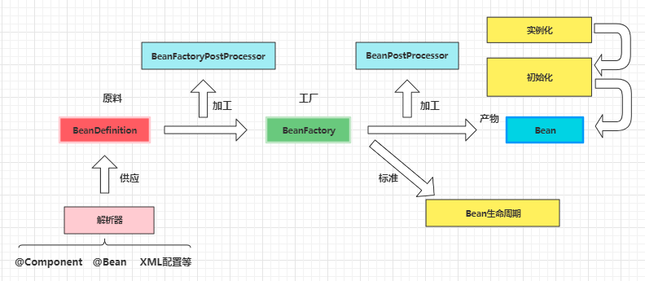
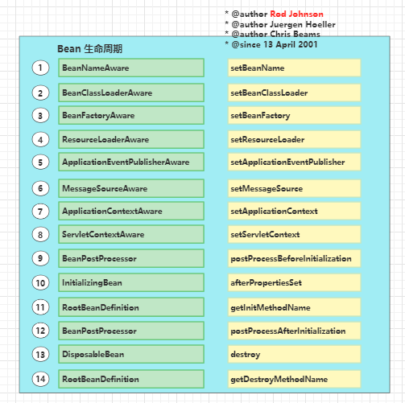

## 什么是spring？
spring是2003年兴起的一个轻量级的java开发框架，它是为了解决企业应用开发的复杂性而创建的。

spring是一个容器，用于降低代码间的耦合度，根据不同情况（不同代码），采用IoC（用于主业务逻辑解耦合）和AOP（用于系统级服务与主业务逻辑解耦合）两种技术进行解耦合。

依赖注入（Dependency Injection，DI）和控制反转（Inversion of Control，IoC）是Spring框架的核心概念和设计原则。
它们通过引入设计模式中的依赖注入和控制反转模式，为应用程序提供了松耦合、可测试和可扩展的架构。本文将详细介绍依赖注入和控制反转的概念、原理和使用方式，
并解释它们在Spring框架中的作用和带来的好处。
### 1. IOC容器初始化流程


#### 1.1 Bean 生命周期


### 2. 依赖注入（Dependency Injection）
#### 2.1 概念
依赖注入是一种设计模式，通过在对象之间解耦合来实现松耦合、可测试和可扩展的应用程序。它的核心思想是将对象之间的依赖关系从代码内部转移到外部容器中进行管理，使得对象只需关注自身的功能实现，而不需要负责依赖对象的创建和管理。

#### 2.2 原理
依赖注入的实现原理是通过构造函数、属性注入或者接口方法注入的方式，将依赖的对象注入到目标对象中。这样，目标对象就不需要自己创建依赖的对象，而是通过外部容器来提供所需的依赖。

依赖注入可以通过三种常见的方式实现：
- 构造函数注入（Constructor Injection）：通过对象的构造函数来注入依赖对象。
- 属性注入（Setter Injection）：通过对象的属性或者Setter方法来注入依赖对象。
- 接口方法注入（Interface Injection）：通过接口方法来注入依赖对象。
- 依赖注入使得对象之间的依赖关系变得松散，提高了代码的可读性、可维护性和可测试性。

### 3. 控制反转（Inversion of Control）
#### 3.1 概念
   控制反转是一种设计原则，用于减少程序的依赖关系，并提高代码的可扩展性和灵活性。它的核心思想是将对象的创建和管理交给外部容器来完成，从而实现对程序控制权的反转。
#### 3.2 原理
控制反转的实现原理是通过外部容器（例如Spring容器）来管理对象的创建和生命周期，并将对象的控制权反转给容器。在传统的编程模型中，对象通常通过自身的代码来创建和管理依赖的对象，而在控制反转中，对象只需要定义自己的依赖关系，而不需要负责对象的创建和管理。

### 4.作用和好处
- 解耦，松耦合性

  通过依赖注入和控制反转，我们可以实现对象之间的松耦合，减少它们之间的直接依赖。这种松耦合性使得代码更容易维护、修改和测试。

- 可测试性

    我们可以通过替换依赖对象来轻松地进行单元测试，而不必关心对象的实际实现.
- 可扩展性

  系统更加易于扩展。当我们需要添加新的功能或模块时，只需创建新的实现类，并通过配置或注解将其注入到现有的对象中，而不需要修改原有的代码。
- 面向接口编程

  依赖注入和控制反转鼓励面向接口编程，这有助于代码的解耦和可维护性。

### 5.工作实践
- 使用接口定义依赖关系

    通过使用接口定义依赖关系，可以实现对象之间的松耦合，并支持灵活的实现替换。当定义依赖关系时，应针对接口而不是具体实现进行编程
    ```java
    public interface NotificationExtPtSender extends ExtensionPoint {
        Response<Void> notification(NoticeMessage messageBody);
    }
    public class EmailNotification implements NotificationExtPtSender {
    @Override
    public Response<Void> notification(NoticeMessage messageBody) {
        ... 代码实现
    }
    public class HttpNotification implements NotificationExtPtSender {
    @Override
    public Response<Void> notification(NoticeMessage messageBody) {
        ... 代码实现
    }
  
    ```
- 使用注解简化配置

  Spring框架提供了注解来简化依赖注入和控制反转的配置过程。通过使用这些注解，可以在代码中直接标记依赖关系，而无需通过配置文件来进行显式配置。

   ```java
    public interface NotificationExtPtSender extends ExtensionPoint {
          Response<Void> notification(NoticeMessage messageBody);
      }
    @Service
    public class EmailNotification implements NotificationExtPtSender {
      public Response<Void> notification(NoticeMessage messageBody) {
          ... 代码实现
      }
    @Service
    public class HttpNotification implements NotificationExtPtSender {
      public Response<Void> notification(NoticeMessage messageBody) {
          ... 代码实现
    }
    public class UserService {
      @Autowired
      private NotificationExtPtSender notificationExtPtSender;
      // 其他代码省略
      }
    ```
- 使用依赖注入容器管理对象的生命周期

  Spring框架提供了依赖注入容器来管理对象的生命周期。通过配置依赖注入容器，可以指定对象的创建、初始化和销毁方式，以及对象之间的依赖关系。
  比如连接池的销毁和创建等（数据库、http请求等）
- 使用注入点解耦依赖关系
  
  在某些情况下，对象可能具有多个依赖关系。为了进一步解耦这些依赖关系，可以使用注入点（Injection Point）来声明依赖。
   ```java
    public class UserService {
      @Autowired
      private NotificationExtPtSender emailNotification;
  
      @Autowired
      private NotificationExtPtSender httpNotification;
      // 其他代码省略
      }
    ```