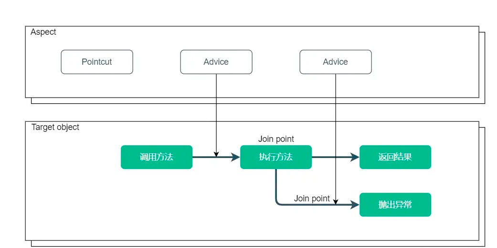
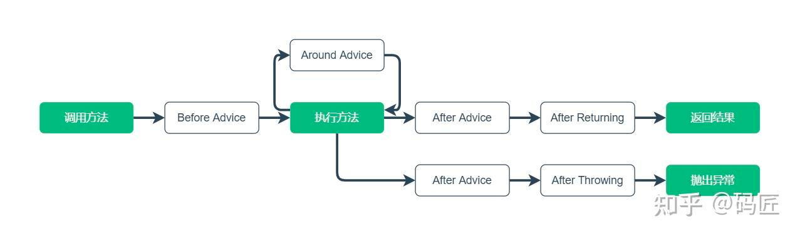
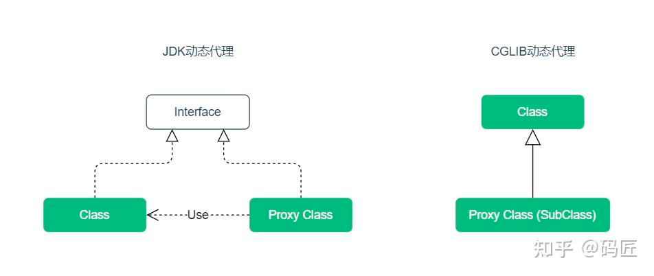

## 概述
AOP 提供一种通用的扩展机制，在业务操作前后提供一些切面的操作，这些操作通常是和业务无关的，例如：日志记录、性能统计、安全控制、事务处理、异常处理等。
### 1. AOP 术语
AOP（Aspect Oriented Programming）面向切面编程的概念比较抽象，主要涉及下面这些术语：

- Aspect（切面）：切入一个或多个类的模块
- Join point（连接点）：程序执行的节点，例如执行方法或处理异常
- Advice（通知）：切面在连接点执行的动作，例如前置通知
- Pointcut（切点）：用于匹配连接点，一般通过表达式匹配
- Target object（目标对象）：被切入的对象，可以被一个或多个切面切入.

使用 AOP 时，需要定义实现切面的类，在切面中指定切点和通知。



一个目标类可以被多个切面切入，多个切面也可以切入一个目标类。切面实现的本质是一个或多个基于连接点的拦截器。

### 2. 通知类型
Spring AOP 提供了下面五种通知类型：
- Before advice（前置通知）：连接点前面执行，不能终止后续流程，除非抛异常.
- After returning advice（后置通知）：连接点正常返回时执行，有异常不执行.
- Around advice（环绕通知）：围绕连接点前后执行，也能捕获处理异常.
- After advice（最终通知）：连接点退出时执行，无论是正常退出还是异常退出.
- After throwing advice（异常通知）：连接点方法抛出异常时执行.

AOP 的连接点一般是指目标类的方法，五种通知类型执行的节点如下：


### 3.动态代理
Spring AOP 底层是基于动态代理实现的，对实现接口的类进行代理，默认使用 JDK 动态代理，对没实现接口的类，使用 CGLIB 动态代理。


#### 3.1 JDK 动态代理
   JDK 动态代理通过实现接口生成代理类，使用拦截器加反射机制生成。
```java

  public static void main(String[] args) {
        // JDK Proxy
        DemoService demoService = new DemoServiceImpl();
        DemoServiceProxy proxy = new DemoServiceProxy();
        DemoService proxyTarget = (DemoService) proxy.getTarget(demoService);
        proxyTarget.doService();
  }
```
- 优点缺点
  - JDK动态代理是JDK原生的，不需要任何依赖即可使用;
  - 通过反射机制生成代理类的速度要比CGLib操作字节码生成代理类的速度更快;
  - 如果要使用JDK动态代理，被代理的类必须实现了接口，否则无法代理;

#### 3.2 CGLIB 动态代理
CGLIB 动态代理通过继承生成代理子类，使用字节码技术生成。
通过子类对父类的方法进行重写来实现代理，因此，对 final 修饰的方法不能代理。
``` java
public static void main(String[] args) {
    // CGLib Proxy
    Enhancer enhancer = new Enhancer();
    enhancer.setSuperclass(DemoServiceImpl.class);
    enhancer.setCallback(new DemoServiceInterceptor());
    DemoService service = (DemoService) enhancer.create();
    service.doService();
}
```
Spring AOP 中的目标类不管有没有实现接口，都可以通过配置来强制使用 CGLIB 代理方式。
``` java

xml配置
<aop:aspectj-autoproxy proxy-target-class="true"/> 

注解的方式
@EnableAspectJAutoProxy(proxyTargetClass = true)

```

### 4.应用场景

#### 1. 日志处理
在调试程序时，如果需要在执行方法前打印方法参数，或者在执行方法后打印方法返回结果，可以使用切面来实现。

```java
@Slf4j
@Aspect
@Component
public class LoggerAspect {
    @Around("execution(* cn.xx.*.*(..))")
    public Object doAround(ProceedingJoinPoint joinPoint) throws Throwable {
        // 方法执行前日志
        log.info("Method args: {}", joinPoint.getArgs());
        Object proceed = joinPoint.proceed();
        // 方法执行后日志
        log.info("Method result: {}", proceed);
        return proceed;
    }
}
```
#### 2.事务控制
Spring 提供的声明式事务也是基于 AOP 来实现的，在需要添加事务的方法上面使用 @Transactional 注解。
```java
@Service
public class DemoService {
    @Transactional(rollbackFor = Exception.class)
    public void insertBatch() {
        // 带事务控制的业务操作
    }
}
```

#### 3.参数校验
如果需要在方法执行前对方法参数进行校验时，可以使用前置通知来获取切入点方法的参数，然后进行校验。
``` java
@Slf4j
@Aspect
@Component
public class ValidatorAspect {
    @Before("execution(* cn.xxx.*.*(..))")
    public void doBefore(JoinPoint joinPoint) {
        // 方法执行前校验参数
        Object[] args = joinPoint.getArgs();
    }
}
```
#### 3.自定义注解（限流，缓存等）
因为 AOP 可以拦截到切入点方法，Spring 也支持通过注解的方式来定义切点表达式，所以可以通过 AOP 来实现自定义注解的功能。
自定义一个注解来实现限流，多请求接口限流
https://mcolley.gitee.io/swak/#/components/swak-ratelimit
```java
 @Documented
    @Target({ java.lang.annotation.ElementType.METHOD })
    @Retention(RetentionPolicy.RUNTIME)
    @SwakFallback
    public @interface RateLimit {
        String key() default ""; //为空默认是 ratelimit_className_methodName
        @AliasFor("value")
        int qps() default -1;
        @AliasFor("qps")
        int value() default -1;
        String retCode() default "";
        String desc() default "";
        
        /**限流兜底方法  {@link SwakFallback#fallbackMethod} **/
        @AliasFor(annotation = SwakFallback.class)
    ....
```

然后定义一个切片来实现操作接口前的限流预判。
```java
      @Override
      public Object invoke(final MethodInvocation invocation) throws Throwable {
          Method method = invocation.getMethod();
          ....忽略代码
          return execute(aopAllianceInvoker, target, method, invocation.getArguments());
      }
      
      @Nullable
      protected Object execute(SwakOperationInvoker invoker, Object target, Method method, Object[] args) {
          ....忽略代码
          boolean isAcquire = limitRaterAdapter.tryAcquire(limitOperation);
          if (!isAcquire) {
              // 触发限流走fallback兜底或则返回限流码
              return getFallback(target,method,args,limitOperation.getRateLimit());
          }
          
     public abstract class SwakAnnotationAdvisor extends AbstractPointcutAdvisor
            implements BeanFactoryAware {
      //返回自己的切点和切面
       @Override
       public Advice getAdvice() {
         return this.advice;
       }
       @Override
       public Pointcut getPointcut() {
         return this.pointcut;
       }
      ....忽略代码

```
### 4. AOP 方法失效问题
Spring AOP 的原理是在原有方法外面增加一层代理，所以在当前类调用 AOP 方法时，因为 this 指向的是当前对象，而不是代理对象，所以 AOP 会失效。
```java
@Service
public class DemoService {
    public void insert() {
        // 该方法事务会失效
        insertBatch();
    }
    @Transactional(rollbackFor = Exception.class)
    public void insertBatch() {
        // 带事务控制的业务操作
    }
}
```
4.1 AOP失效解决
- 使用 ApplicationContext 来手动获取Bean对象，来调用AOP方法
```java
@Service
public class DemoService {
    @Autowired
    private ApplicationContext applicationContext;
    public void insert() {
        DemoService demoService = applicationContext.getBean(DemoService.class);
        demoService.insertBatch();
    }
    @Transactional(rollbackFor = Exception.class)
    public void insertBatch() {
        // 带事务控制的业务操作
    }
}
```
- 使用 AopContext 工具类来获取当前对象的代理对象
```java
@Service
public class DemoService {
    public void insert() {
        ((DemoService) AopContext.currentProxy()).insertBatch();
    }
    @Transactional(rollbackFor = Exception.class)
    public void insertBatch() {
        // 带事务控制的业务操作
    }
}
```
- 注入自身Bean
 
  使用Spring注入自身来调用AOP方法
```java
@Service
public class DemoService {

    @Autowired
    private DemoService that;

    public void insert() {
        that.insertBatch();
    }
    @Transactional(rollbackFor = Exception.class)
    public void insertBatch() {
        // 带事务控制的业务操作
    }
}
```
## 思考

- AOP的缺点是什么？
