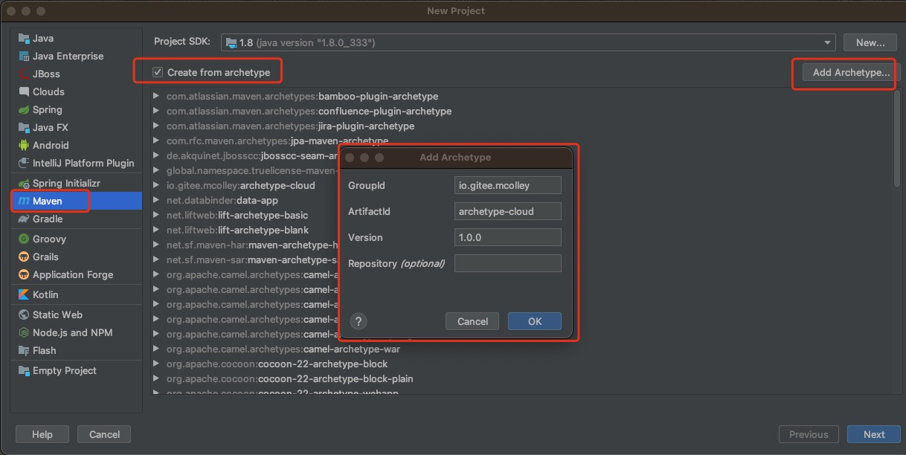
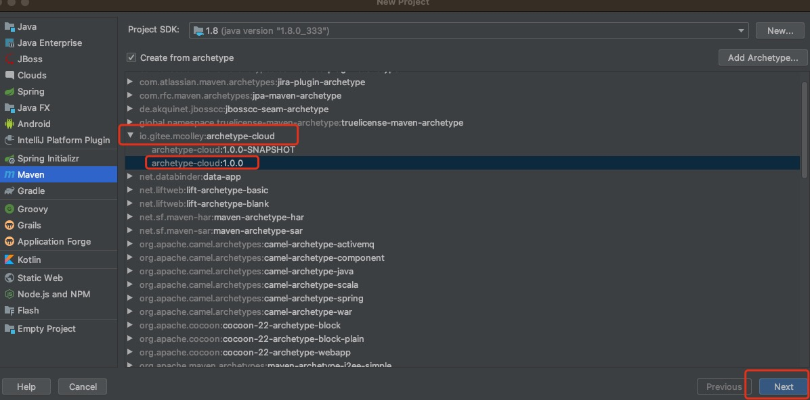
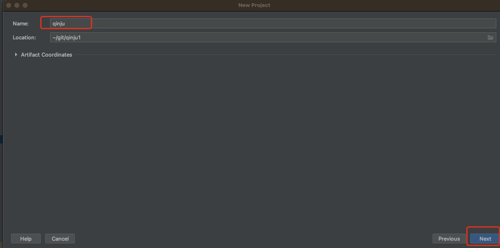
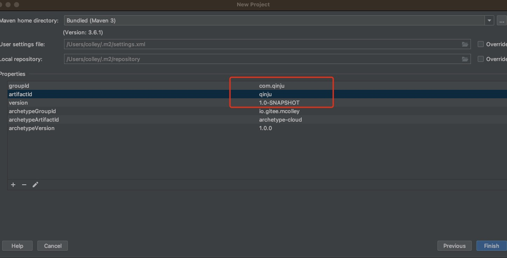

## 使用说明
SWAK-Cloud内置了自己的脚手架，可以直接使用脚手架来生产自己的项目
目前脚手架最新版本：1.0.0
## 使用介绍
```xml
  <dependency>
      <groupId>io.gitee.mcolley</groupId>
      <artifactId>archetype-cloud</artifactId>
     <version>1.0.0</version>
   </dependency> 
```

## 脚手架生成项目骨架
####  命令行方式

```shell
语法:
mvn archetype:generate \
-DarchetypeGroupId=io.gitee.mcolley \
-DarchetypeArtifactId=archetype-cloud \
-DarchetypeVersion=1.0.0 \
-DgroupId=com.qinju \
-DartifactId=qinju \
-Dversion=1.0.0.SNAPSHOT \
-Dpackage=com.qinju \
-DinteractiveMode=false
```
参数 | 说明 | 备注 | 示例
------ | ---- | ---- | ----
groupId | 新建项目groupId | | com.qinju
artifactId | 新建项目artifactId	| | qinju
package | 新建项目基础包 |	| com.qinju
version | 新建项目版本号 | | 1.0.0-SNAPSHOT
archetypeGroupId |  脚手架的groupId | io.gitee.mcolley |
archetypeArtifactId | 脚手架的artifactId | archetype-cloud |
archetypeVersion | 脚手架的版本 | 目前暂无版本迭代固定1.0.0 | 1.0.0

```shell
完整示例:
mvn archetype:generate \
-DarchetypeGroupId=io.gitee.mcolley \
-DarchetypeArtifactId=archetype-cloud \
-DarchetypeVersion=1.0.0 \
-DgroupId=com.qinju \
-DartifactId=qinju \
-Dversion=1.0.0.SNAPSHOT \
-Dpackage=com.qinju \
-DinteractiveMode=false
```

#### 2.2 IDE工具
1. 安装插件（Maven Archetype Catalogs） 选择对应的脚手架创建自己的项目










项目结构如下：
```xml
├── pom.xml
├── qinju-api
├── qinju-app
├── qinju-common
├── qinju-infrastructure
├── qinju-server

```