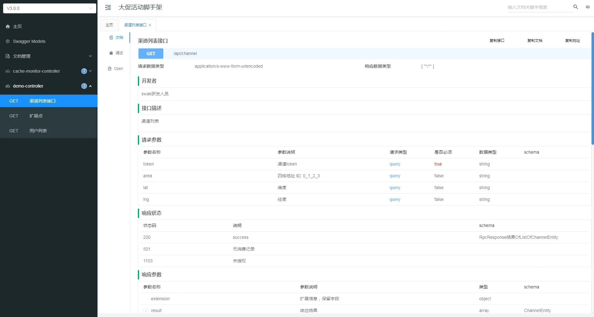

## 原理

通过Spring Boot的autoConfig机制进行加载，集成Knife4j (https://gitee.com/xiaoym/knife4j) 无需手动配置，只需要添加如下依赖即可：

```xml
        <dependency>
             <groupId>io.gitee.mcolley</groupId>
            <artifactId>swak-swagger-boot-starter</artifactId>
        </dependency>
```

## application配置

```xml
    #swagger API配置#
    swak.swagger.enable=true
    swak.swagger.production=false
    swak.swagger.info.title=活动脚手架
    swak.swagger.info.description=活动脚手架搭建
    swak.swagger.info.contact.url=https://swak.xx.com
    swak.swagger.info.contact.email=swak@xx.com
    swak.swagger.info.contact.name=SWAK研发组
    ##开启认证##
    swak.swagger.basic.enable=true
    swak.swagger.basic.username=xx
    swak.swagger.basic.password=xxx
```

## 使用介绍
 Controller上开启swagger，访问http://ip/doc.html
例子：

```xml

	@ApiOperationSupport(author = "swak研发人员")
	@RequestMapping("channel")
	@ApiOperation(value = "渠道列表接口", httpMethod = "GET", notes = "渠道列表")
	@ApiImplicitParams({@ApiImplicitParam(name = "token", value = "渠道token", paramType = "query", required = true, dataType = "String"),
        @ApiImplicitParam(name = "lng", value = "经度", paramType = "query", required = false, dataType = "String"),
        @ApiImplicitParam(name = "lat", value = "维度", paramType = "query", required = false, dataType = "String"),
        @ApiImplicitParam(name = "area", value = "四级地址 如: 0_1_2_3", paramType = "query", required = false, dataType = "String")})
	@io.swagger.annotations.ApiResponses(value={@io.swagger.annotations.ApiResponse(code = 200, message = "success"),
		      @io.swagger.annotations.ApiResponse(code = 1103, message = "未授权"),
		      @io.swagger.annotations.ApiResponse(code = 501, message = "无消费记录")})
	public RpcResponse<List<ChannelEntity>> channel() {
	   ....
	}

```

## 页面预览
访问http://ip/doc.html  页面预览如下：

